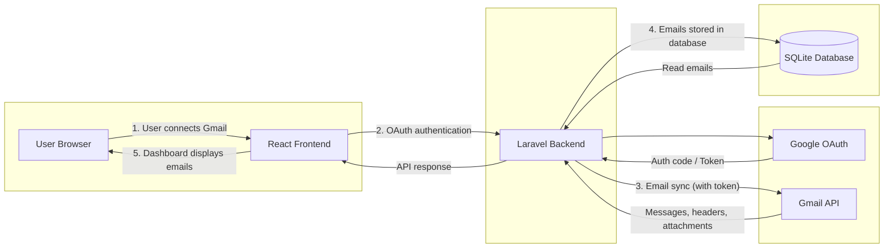

# BeyondChats Gmail Integration Dashboard

A full-stack Gmail integration dashboard that lets users connect their Gmail account and manage email conversations from a single dashboard.

---

## 1. Project Overview

This project is a **Gmail Integration Dashboard** built for the **BeyondChats employment assignment**. It allows users to connect their Gmail account via Google OAuth and view, sync, and reply to emails from a responsive web dashboard.

### Features

- **Connect Gmail account** using Google OAuth
- **Sync emails** from Gmail with configurable date range
- **Select how many days** of emails to sync (7, 15, or 30 days)
- **Store emails** in a local database (SQLite)
- **View synced emails** in a dashboard table (From, To, Subject, Attachments)
- **View full email thread** — open a conversation and see all messages in the thread
- **Show sender and receiver details** for each email
- **Display attachments** — list attachment file names for each message
- **Reply to emails** directly from the dashboard
- **Responsive UI** — works on desktop and mobile (including iPhone SE)

---

## 2. Tech Stack

| Layer        | Technology    |
|-------------|---------------|
| **Frontend** | ReactJS       |
| **Backend**  | Laravel (PHP) |
| **Database** | SQLite        |
| **Auth / API** | Google OAuth, Gmail API |

- **ReactJS** — UI and dashboard
- **Laravel** — REST API, OAuth callback, Gmail integration
- **Gmail API** — list messages, send replies, read headers and attachments
- **SQLite** — store synced emails and metadata
- **Google OAuth** — secure Gmail connection

---

## 3. Architecture / Data Flow

### Architecture Diagram



**Flow summary:**

| Step | Flow | Description |
|------|------|-------------|
| 1 | User Browser → React Frontend | User clicks "Login with Google" or "Sync Emails". |
| 2 | React → Laravel → Google OAuth | OAuth authentication; Laravel redirects to Google and handles callback. |
| 3 | Laravel → Gmail API | Email sync: list messages, fetch headers/attachments using access token. |
| 4 | Laravel → SQLite | Store/update emails (sender, receiver, subject, thread_id, attachments). |
| 5 | Laravel → React → User | Dashboard fetches emails from API and displays them in the table. |

### OAuth Flow

1. User clicks **Login with Google** in the React app.
2. Browser redirects to Laravel `/auth/google`, which redirects to **Google’s OAuth consent screen**.
3. User signs in and grants Gmail read/send permissions.
4. Google redirects back to Laravel `/auth/google/callback` with an authorization code.
5. Laravel exchanges the code for an **access token** and redirects to the React app with the token in the URL (`?access_token=...`).
6. React reads the token, stores it in `localStorage`, and uses it for all Gmail API calls (sync and reply).

### Email Sync Flow

1. User selects **Last 7 / 15 / 30 Days** and clicks **Sync Emails**.
2. React sends `GET /fetch-emails?days=<n>&token=<access_token>` to Laravel.
3. Laravel uses the Gmail API to list messages with query `after:YYYY/MM/DD`, fetches each message’s headers (From, To, Subject) and attachment filenames from `payload.parts`, and stores/updates records in SQLite via the `Email` model.
4. Laravel returns the synced email list; the dashboard loads the full list from `GET /emails` and displays it in the table.

---

## 4. Setup Instructions

### Prerequisites

- PHP 8.x, Composer
- Node.js and npm
- A Google Cloud project with Gmail API enabled and OAuth 2.0 credentials (Client ID and Client Secret)

### Backend Setup

```bash
cd backend
composer install
cp .env.example .env
php artisan key:generate
```

**Configure Google OAuth in `.env`:**

```env
GOOGLE_CLIENT_ID=your_client_id.apps.googleusercontent.com
GOOGLE_CLIENT_SECRET=your_client_secret
GOOGLE_REDIRECT_URI=http://localhost:8000/auth/google/callback
FRONTEND_URL=http://localhost:3000
```

In [Google Cloud Console](https://console.cloud.google.com/), add `http://localhost:8000/auth/google/callback` to the OAuth 2.0 redirect URIs.

**Run migrations and start the server:**

```bash
php artisan migrate
php artisan serve
```

Backend runs at **http://localhost:8000**.

### Frontend Setup

```bash
cd frontend
npm install
npm start
```

Frontend runs at **http://localhost:3000**. Open this URL in the browser to use the dashboard.

---

## 5. Usage

1. **Click “Login with Google”** — you will be redirected to Google to sign in and authorize Gmail access.
2. **Return to the dashboard** — the app will store the token and you’ll see the sync controls.
3. **Choose how many days** of emails to sync (Last 7, 15, or 30 Days) from the dropdown.
4. **Click “Sync Emails”** — emails in the selected range are fetched from Gmail and saved to the database.
5. **View emails** in the table (From, To, Subject, Attachments).
6. **Click “View thread”** on any row to open the full email thread.
7. **Click “Reply”** to write a reply; enter your message and click **Send Reply** to send via Gmail.

---

## 6. Features Implemented

- **Gmail OAuth authentication** — connect account and receive access token
- **Email syncing with date filter** — 7, 15, or 30 days via Gmail API query
- **Email storage in database** — SQLite with `emails` table (sender, receiver, subject, thread_id, attachments)
- **Email thread viewing** — `GET /thread/{threadId}` and “View thread” in the UI
- **Attachments detection** — parse `payload.parts` for filenames and display in the dashboard
- **Reply to email** — `POST /reply` with token, thread_id, to, subject, message; sends via Gmail API in the same thread
- **Responsive dashboard UI** — table with horizontal scroll and mobile-friendly styles (e.g. iPhone SE)

---

## 7. Project Structure

```
beyondchats-gmail-dashboard/
├── backend/                 # Laravel API
│   ├── app/
│   │   ├── Http/Controllers/
│   │   │   └── GmailController.php   # OAuth, sync, thread, reply
│   │   └── Models/
│   │       └── Email.php
│   ├── config/
│   │   ├── services.php     # Google OAuth config
│   │   └── cors.php
│   ├── database/
│   │   └── migrations/      # emails table, attachments, receiver
│   ├── routes/
│   │   └── web.php          # /auth/google, /fetch-emails, /emails, /thread/{id}, /reply
│   └── .env.example
├── frontend/                # React dashboard
│   ├── src/
│   │   ├── App.js           # Dashboard, sync, thread, reply UI
│   │   └── App.css          # Table and responsive styles
│   └── public/
└── README.md
```

- **backend/** — Laravel app: Gmail OAuth, Gmail API calls, SQLite, REST routes.
- **frontend/** — React app: login link, days selector, sync button, email table, thread view, reply form.

---

## 8. Assignment Context

This project was built as part of the **BeyondChats Full Stack Developer** employment assignment. It demonstrates integration with the Gmail API, OAuth 2.0, a Laravel backend, and a React frontend with a responsive UI.

---

## 9. Demo

A demo video is provided showing all features: connecting Gmail, syncing emails, viewing threads, and replying from the dashboard.

---

## 10. License

MIT License — free for educational and personal use.
